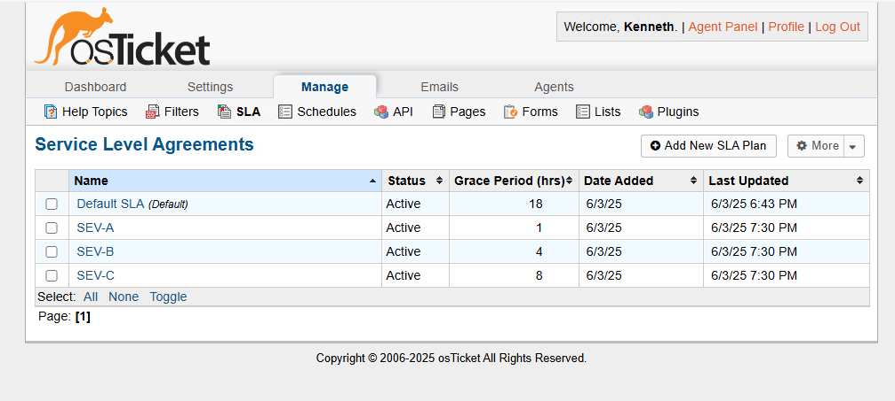
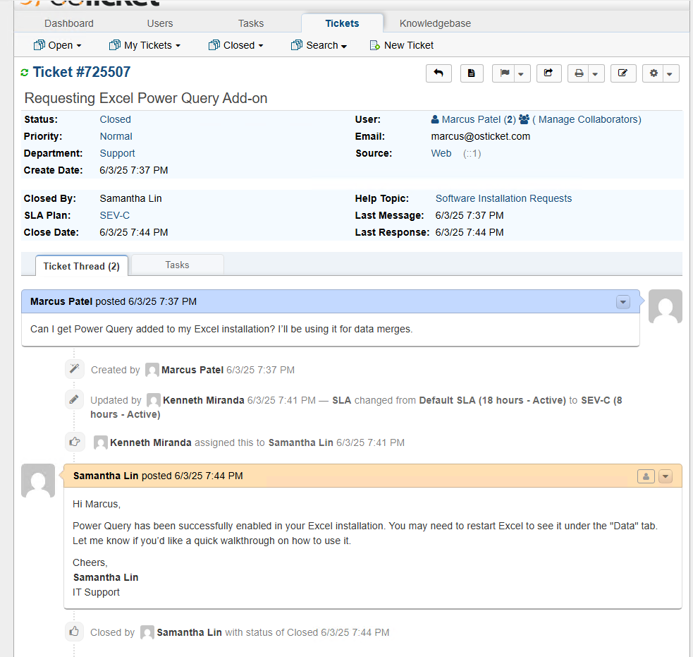

# 🎫 osTicket Help Desk Lab on Microsoft Azure Virtual Machine

This walkthrough demonstrates how to deploy and configure osTicket—an open-source support ticket system—on a Windows 10 Pro VM in Microsoft Azure, designed for IT Support professionals seeking hands-on experience.

---

## 🧰 Prerequisites

- Microsoft Azure account  
- Windows 10
- Remote Desktop Connection (RDP)  
- [Installation Files](https://drive.google.com/file/d/1jtT1qSjMyhxrPzZKBau8jkmWbl-9qkzp/view?usp=sharing) 

---

## ☁️ 1. Setup Azure Virtual Machine

1. Sign into Azure Portal.  
2. Create a Resource Group named `osTicket`.  
3. Create a new Virtual Machine in this group:  
   - **OS**: Windows 10 Pro (Version 22H2, x64 Gen2)  
   - **Size**: 4 vCPUs, 16 GiB RAM (if your system supports it)  
4. Deploy the Virtual Machine.  
5. Connect via Remote Desktop using the public IP and credentials.  

📸 *Insert screenshot of Azure VM setup and RDP connection*

---

## 🔧 2. Enable Required Windows Features

1. Open **Turn Windows features on or off**.  
2. Enable the following:

   ```
   ✔ World Wide Web Services
     ✔ Application Development Features → CGI
     ✔ Common HTTP Features
   ✔ Web Management Tools → IIS Management Console
   ```

📸 *Insert screenshot of enabled features*

---

## 📥 3. Install Dependencies

Download and install the following (from provided Google Drive):

- PHPManagerForIIS  
- rewrite_amd64  
- Unzip **PHP 8.2.16** to `C:\PHP`  
- VC_redist.x64  
- MySQL 8.0 (Server only) → Set root password  
- HeidiSQL   

📸 *Insert screenshot of installations and C:\PHP directory*

---

## 🗄️ 4. Configure MySQL and Database

1. Open **HeidiSQL**, create a new session with root user and testing password.  
2. Create a new database named: `osTicket`.  

📸 *Insert screenshot of HeidiSQL session and database*

---

## 🌐 5. Configure IIS + PHP + osTicket

1. Open **IIS Manager** (as Administrator).  
2. Select PHP Manager → Register new PHP version:  
   - Path: `C:\PHP\php-cgi.exe`  
3. Unzip osTicket.  
4. Copy the `upload` folder to `C:\inetpub\wwwroot\` and rename it to `osTicket`.  
5. In IIS, go to:  
   - Sites → Default Web Site → osTicket → Browse *:80  

📸 *Insert screenshots of IIS PHP config and osTicket folder*

---

## 🛠️ 6. Enable PHP Extensions

In PHP Manager, enable:

- php_imap.dll  
- php_intl.dll  
- php_opcache.dll  

📸 *Insert screenshot of enabled extensions*

---

## 🗂️ 7. Configure osTicket Files

1. Rename:  
   `C:\inetpub\wwwroot\osTicket\include\ost-sampleconfig.php` → `ost-config.php`  
2. Right-click → Properties → Security → Add **Everyone** with **Full Control**  

📸 *Insert file rename and permissions screenshot*

---

## 🚀 8. Launch osTicket Installer

1. Open browser → go to:  
   `http://localhost/osTicket/`  
2. Complete the Basic Installation:  
   - Database name: `osTicket`  
   - DB User + Password: *(as set in MySQL)*  

📸 *Insert screenshot of osTicket setup form*

---

## 🔐 9. Post-Install Security

1. Delete the setup folder:  
   `C:\inetpub\wwwroot\osTicket\setup`  
2. Modify `ost-config.php` permissions:  
   - Remove **Everyone: Full Control**  
   - Keep **Read-only**  

📸 *Insert screenshot of permissions*

---

## 🧪 10. Initial Admin Setup

1. Log into the osTicket admin panel:  
   `http://localhost/osTicket/scp/login.php`  
2. Create:  
   - Super Admin role with all permissions
     
     

   - System Administrators department

     

   - Level II Support team

     

   - Sample SLA: SEV-A (1 hour & 24/7), SEV-B (4 hours & 24/7), SEV-C (8 hours & 24/5)

     

---

## 🧾 11. Add Help Topics

Go to:  
**Manage → Help Topics → Add New**  

Sample Help Topics:

- Email Issues  
- VPN / Remote Access Problems  
- Software Installation Requests  
- Hardware Problem / Replacement  

  

---

## 👥 12. Add Agent Accounts (Test)

Go to:  
**Agents → Add New Agent**

- **Ethan Reyes**  
  - Email: ethan@osticket.com  
  - Username: ethan.reyes

     

- **Samantha Lin**  
  - Email: samantha@osticket.com  
  - Username: samantha.lin

     

- Set Password for both:
   - Deselect "Send the agent a password reset email"
   - Set a testing password
   - Deselect "Require password change at next login"

    

- Assign both to:
  - Department: System Administrators  
  - Role: Supreme Admin

      

---

## 👤 13. Add User Accounts (Test)

Go to:  
**Agent Panel → Users → Add User**

- **Lila Grant** → lila@osticket.com

   
  
- **Marcus Patel** → marcus@osticket.com  

   

---

## 📨 14. Create Sample Tickets

Go to: `http://localhost/osTicket/` → **Open New Ticket**

### 🎟 Ticket 1  

**User**: Marcus Patel (marcus@osticket.com)  

**Help Topic**: VPN / Remote Access Problems 

**Subject**: Unable to access remote desktop – urgent! 

**Message**: I’m completely locked out of the remote desktop. I have reports due and can't access any files.

  

### 🎟 Ticket 2  

**User**: Marcus Patel (marcus@osticket.com)  

**Help Topic**: Software Installation Requests 

**Subject**: Requesting Excel Power Query Add-on  

**Message**: Can I get Power Query added to my Excel installation? I’ll be using it for data merges.


### 🎟 Ticket 3  

**User**: Lila Grant (lila@osticket.com)  

**Help Topic**: Email Issues  

**Subject**: Email not syncing on mobile device 

**Message**: My Outlook isn’t syncing emails on my phone. I can’t reply to candidates on the go.


### 🎟 Ticket 4  

**User**: Lila Grant (lila@osticket.com)  

**Help Topic**: Hardware Problem / Replacement 

**Subject**: Keyboard keys unresponsive 

**Message**: Several keys on my keyboard aren’t working. Can I get a replacement today?


---

## 📋 15. Assign Tickets

Go to:  
`http://localhost/osTicket/scp/tickets.php`

| Ticket                     | Priority   | SLA    | Assignee       |
|----------------------------|------------|--------|----------------|
| 1 - VPN / Remote Access    | Emergency  | SEV-A  | Ethan Reyes    |
| 2 - Software Installation  | Normal     | SEV-C  | Samantha Lin   |
| 3 - Email Issues           | High       | SEV-B  | Samantha Lin   |
| 4 - Hardware Problem       | High       | SEV-B  | Ethan Reyes    |

---

## 🧑‍💼 16. Respond as Agents

🔐 **Sign in as Ethan Reyes** (ethan.reyes / password) 
- Ticket 1 - VPN / Remote Access
  
  Agent Reply:
  Hi Marcus,

  We’ve identified the cause of the remote desktop issue — your VPN session had become corrupted. We've reset your VPN credentials and restarted your remote desktop instance. You should now be able to connect as normal.

  Please try logging in again and let us know if you're still experiencing issues.

  Best regards,
  Ethan Reyes
  IT Support

  Internal Note: 
  VPN session timed out improperly. Reset credentials and restarted RDP instance on 10.0.0.25. Added user to reconnection watchlist.

  Ticket Status: Resolved
   
  
   
- Ticket 4 - Hardware Problem / Replacement
  
  Agent Reply:
  Hi Lila,

  We’ve replaced your keyboard with a new one (Model: Logitech K120). The faulty unit will be sent for RMA. Please confirm if the new keyboard is working correctly.

  Let us know if you need anything else.

  Regards,
  Ethan Reyes
  IT Support

  Internal Note:
  Delivered replacement keyboard at 2:10 PM. Verified function on user machine. Old unit tagged and added to RMA queue.

  Ticket Status: Resolved  

  

🔐 **Sign in as Samantha Lin** (samantha.lin / password) 
- Ticket 2 - Software Installation
  
  Agent Reply:
  Hi Marcus,

  Power Query has been successfully enabled in your Excel installation. You may need to restart Excel to see it under the "Data" tab. Let me know if you’d like a quick walkthrough on how to use it.

  Cheers,
  Samantha Lin
  IT Support

  Internal Note:
  Used Office deployment tool to modify install and enable Power Query. Confirmed on Teams with Marcus that feature is active.

  Ticket Status: Closed

  

- Ticket 3 - Email Issues
  
  Agent Reply:
  Hi Lila,

  We've reconfigured your email settings on your mobile device remotely. You should now see all recent emails synced. If you encounter any further delays or sync failures, try restarting the app or contacting us again.

  Thanks for your patience!

  Best,
  Samantha Lin
  IT Support

  Internal Note:
  Re-synced Lila’s Exchange account via MDM and confirmed delivery of recent test email on mobile. No further action required.

  Ticket Status: Resolved
 
  

---

## ✅ Lab Complete!

You now have a fully functioning osTicket environment hosted on an Azure Virtual Machine, with:

- Users & Agents  
- SLAs & Help Topics  
- Realistic ticket workflows  
